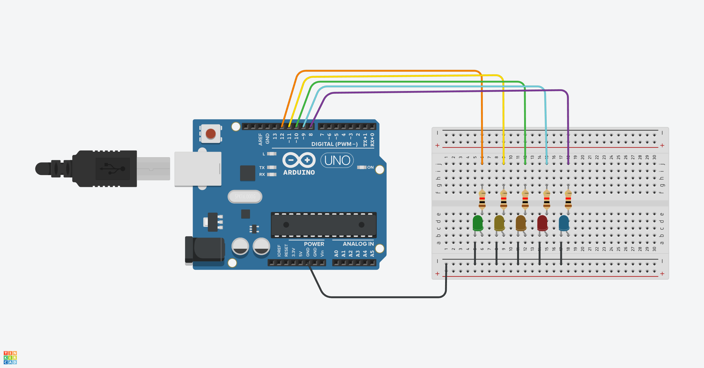

# Laboratory Activity 2: Working with Analog Signal - Analog Signal Fading Sequence

## 📖 Overview
This activity introduces the concept of **Analog Signals** using **Pulse Width Modulation (PWM)**. Unlike digital signals that are strictly **ON** (HIGH) or **OFF** (LOW), PWM allows us to simulate varying voltage levels to control the brightness of LEDs.

The program creates a sequential effect where each LED gradually fades in to full brightness, waits, and then the sequence repeats to fade each LED out. This demonstrates how to use nested `while` loops to control both timing and intensity.

*> **Note:** Ideally, this code should be run on pins that support PWM. On a standard Arduino Uno, pins 3, 5, 6, 9, 10, and 11 support PWM. Pins 12 and 8 may not fade smoothly and might act as simple digital ON/OFF pins, but the logic remains valid.*

## 🛠 Components Used
* **Arduino Board** (Uno, Nano, or similar): The microcontroller to execute the PWM logic.
* **5x LEDs**: Visual indicators to demonstrate brightness changes.
* **5x Resistors** (220Ω - 330Ω): Current limiting resistors.
* **Breadboard**: For circuit assembly.
* **Jumper Wires**: To connect pins to the LEDs.

## 🔌 Wiring Diagram
The LEDs are connected to digital pins 12 through 8.




| Component | Arduino Pin | Connection Details |
| :--- | :--- | :--- |
| **LED 1** | Pin 12 | Connect in series with a resistor to Pin 12 |
| **LED 2** | Pin 11 | Connect in series with a resistor to Pin 11 |
| **LED 3** | Pin 10 | Connect in series with a resistor to Pin 10 |
| **LED 4** | Pin 9 | Connect in series with a resistor to Pin 9 |
| **LED 5** | Pin 8 | Connect in series with a resistor to Pin 8 |
| **GND** | GND | The resistor can be placed on either the Anode (+) or Cathode (-) side of the LED. Just ensure the circuit path flows from the Signal Pin → LED/Resistor → Ground. |


## 💻 Code Explanation
The code uses `while` loops to manage the sequence and brightness levels.

### 1. Global Variables & Setup
First, we define the array of pins. Inside `setup()`, we use a `while` loop to iterate through the array indices (0 to 4) and configure them as output pins.

```cpp
int ledPins[] = {12, 11, 10, 9, 8};

void setup() {
  int i = 0;
  while(i < 5){
    pinMode(ledPins[i], OUTPUT);
    i++;
  }
}
```
### 2. Main Loop: Fade In Sequence
The loop() function begins by iterating through each LED. Inside this loop, a nested while loop gradually increases the power (brightness) from 0 to 255.

- **analogWrite(ledPins[i], power)**: Sets the brightness level
- **delay(1)**: A short delay determines how fast the fade happens.

```cpp
void loop() {
  int i = 0;
  while(i < 5) {
    int power = 0;
    while(power <= 255){
      analogWrite(ledPins[i], power);
      delay(1);
      power++;
    }
    delay(1000); // Keep LED on for 1 second
    i++;
  }
```

### 3. Main Loop: Fade Out Sequence
After the first sequence finishes, the variable i is reset (via j) to iterate through the LEDs again. The nested loop decreases power from 255 down to 0, gradually dimming the LED until it is off.


```cpp
int j = i - 5; // Reset index to start from the first LED again
  while(j < 5){
    int power = 255;
    while(power >= 0){
      analogWrite(ledPins[j], power);
      delay(1);
      power--;
    }
    delay(1000); // Wait 1 second before next LED
    j++;
  }
}
```

