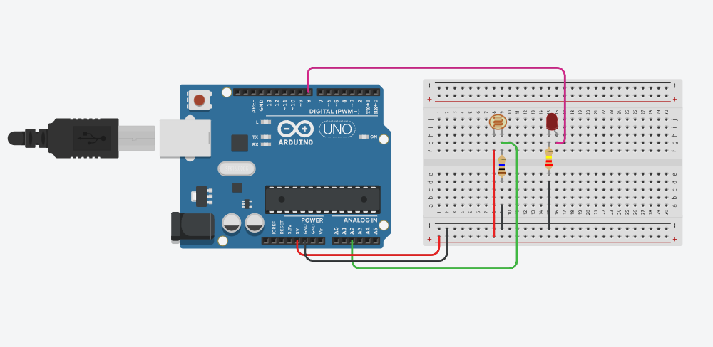

# Laboratory Activity 4: Arduino Serial Connection

## 📖 Overview
This activity demonstrates **Two-Way Serial Communication**. While previous activities only sent data *from* the Arduino *to* the computer, this project enables the Arduino to receive text commands *from* the user via the Serial Monitor.

The system acts as a smart alarm:
1. It monitors light levels using a **Photoresistor**.
2. If the light exceeds a specific threshold, it triggers an "Alarm Mode" (blinking LED).
3. The alarm **cannot stop automatically**. It locks the system into a loop and waits for the user to type the password **"stop"** in the Serial Monitor to reset the system.

## 🛠 Components Used
* **Arduino Board** (Uno, Nano, or similar): The central controller.
* **1x Photoresistor (LDR)**: Analog sensor to detect light intensity.
* **1x LED (Any Color)**: Visual alarm indicator.
* **1x 10kΩ Resistor**: Required for the LDR voltage divider.
* **1x 220Ω Resistor**: Current limiting resistor for the LED.
* **Jumper Wires & Breadboard**: For circuit connections.

## 🔌 Wiring Diagram
The circuit uses an analog input for the sensor and a digital output for the LED.



| Component | Arduino Pin | Connection Details |
| :--- | :--- | :--- |
| **Photoresistor** | Pin A2 | Connect one leg to 5V. Connect the other leg to **A2** AND to GND via a **10kΩ resistor**. |
| **LED** | Pin 12 | Connect the long leg (+) to **Pin 12** and the short leg (-) to GND via a **220Ω resistor**. |
| **GND** | GND | Common ground connection. |

## 💻 Code Explanation

### 1. Helper Function
We define `readBright()` to handle the sensor reading. It reads the raw analog value (0-1023) from the LDR and maps it to a smaller range (0-255) for easier handling.

```cpp
#define photoresistorPin A2
#define ledPin 12
const int brightThreshold = 220;

int readBright() {
  int Brightness = analogRead(photoresistorPin);
  float brightMap = map(Brightness, 0, 1023, 0, 255);
  return brightMap;
}
```

### 2. Main Loop: Monitoring
The loop continuously prints the current brightness to the Serial Monitor. It checks if the brightness crosses the brightThreshold (220). If it does, the flag choice is set to true, triggering the alarm loop.
```cpp
void loop() {
  int currentBright = readBright();

  Serial.print(" Brightness: ");
  Serial.println(currentBright);
  delay(100);

  bool choice = false;
  if (currentBright >= brightThreshold) {
    choice = true;
  }
```
### 3. Alarm Loop & Serial Input
Once inside the while(choice == true) loop, the normal sensing stops, and the Arduino focuses on the alarm status.

- **Serial.readStringUntil('\n')**: The Arduino listens for text input from the computer.
- **input.toLowerCase()**: Converts the typed text to lowercase so that "STOP", "Stop", and "stop" all work.

Logic:
If the input is "stop": The LED turns off, and the break command exits the alarm loop, returning to normal monitoring.
Otherwise: The LED blinks continuously.
```cpp
while (choice == true) {
    // Wait for user input
    String input = Serial.readStringUntil('\n');
    input.toLowerCase();

    // Check if the password is correct
    if (input == "stop") {
      digitalWrite(ledPin, LOW);
      break; // Exit the alarm loop
    } else {
      // Blink the LED while waiting
      digitalWrite(ledPin, HIGH);
      delay(100);
      digitalWrite(ledPin, LOW);
      delay(100);
    }
  }
}
```
